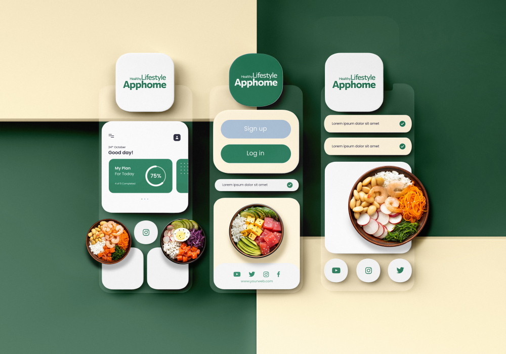

# Building React projects with Tailwind CSS



In the “Building React Projects with Tailwind CSS” project, you will learn how to create a responsive and visually appealing Recipe Sharing Platform using React and Tailwind CSS.

By the time you are done with this project, you will cover essential concepts for integrating Tailwind CSS with React, allowing you to build and style web applications efficiently.

NB: Feel free to search for resources or learning material that will enable you to complete this project successfully.

# Learning Objectives

By the end of this project, you will be able to:

### 1.Set Up a React Application with Tailwind CSS:

- Create a new React project and configure it to use Tailwind CSS for utility-first styling.

### 2.Build and Style a Responsive Home Page:

- Develop the Home Page of the Recipe Sharing Platform to display a list of recipes using Tailwind CSS for a responsive and user-friendly layout.

### 3.Create and Style a Recipe Detail Page:

- Implement a Recipe Detail Page that provides comprehensive information about each recipe, ensuring it is styled consistently with the Home Page using Tailwind CSS.

### 4.Implement a Responsive Form for Adding New Recipes:

- Build a form that allows users to submit new recipes, including validation and responsive design, styled with Tailwind CSS.

By completing these tasks, you will gain practical experience in using Tailwind CSS with React, enabling you to build modern, responsive web applications with ease.

# TASKS

## 0. Setting Up a React Application for a Recipe Sharing Platform with Tailwind CSS `MANDATORY`

**Objective:** Begin building a Recipe Sharing Platform using React and Tailwind CSS. This task focuses on setting up the project foundation, including the creation of the React app, installing Tailwind CSS, and preparing a clean workspace for further development.

## Project Overview:

The Recipe Sharing Platform will allow users to browse, add, and share recipes. It will feature multiple pages including a home page with a list of recipes, a detailed view for individual recipes, and a form to submit new recipes.

## Task Description:

Start by setting up a new React project integrated with Tailwind CSS. This initial setup lays the groundwork for developing a responsive and visually appealing application.

## Step 1: Create a New React Project

- React Project Setup:
  - Open your terminal and set up a new React application:

```
npm create vite@latest recipe-sharing-platform -- --template react
cd recipe-sharing-platform
```

## Step 2: Install and Configure Tailwind CSS

- Tailwind CSS Installation:
  - Add Tailwind CSS and its dependencies to your project:

```
npm install -D tailwindcss postcss autoprefixer
```

- Set up Tailwind CSS using the Tailwind CLI:

```
npx tailwindcss init -p
```

- Modify the `tailwind.config.js` to enable purging of unused styles in production builds:

```
module.exports = {
      purge: ['./src/**/*.{js,jsx,ts,tsx}', './public/index.html'],
      darkMode: false,
      theme: {
        extend: {},
      },
      plugins: [],
    };
```

- Configure your project to include Tailwind in your CSS. Add this to `src/index.css`:

```
@tailwind base;
@tailwind components;
@tailwind utilities;
```

## Step 3: Verify Tailwind CSS Integration

- Test Tailwind CSS Setup:
  - Run your React application to ensure Tailwind CSS is integrated correctly:

```
npm run dev
```

- Check the browser to see if the app loads without any errors and Tailwind’s styles are applied (you can test by adding a Tailwind utility class like `text-blue-500` to a component).

### Repo:

- GitHub repository: `alx-fe-reactjs`
- Directory: `recipe-sharing-platform`

## 1. Building the Home Page of the Recipe Sharing Platform `MANDATORY`

**Objective:** Develop the Home Page for the Recipe Sharing Platform using React and style it with Tailwind CSS. This page will display a list of recipes, each with a brief summary, an image, and a link to view the recipe in detail.

## Task Description:

This task involves creating a responsive Home Page that presents a list of recipes in an attractive and user-friendly layout. You will fetch mock data from a static JSON file and use Tailwind CSS to style the page.

## Step 1: Create Mock Recipe Data

- Prepare Mock Data:
  - Create a `data.json` file in the src directory containing an array of recipe objects. Each recipe should have an `id`, `title`, `summary`, and `image` URL.
  - Example JSON structure:

```
[
  {
    "id": 1,
    "title": "Spaghetti Carbonara",
    "summary": "A classic Italian pasta dish with eggs, cheese, bacon, and black pepper.",
    "image": "https://via.placeholder.com/150"
  },
  {
    "id": 2,
    "title": "Chicken Tikka Masala",
    "summary": "Chunks of grilled chicken (tikka) cooked in a smooth buttery & creamy tomato based gravy.",
    "image": "https://via.placeholder.com/150"
  }
]
```

## Step 2: Create the Home Page Component

- Component Setup:
  - Create a `HomePage` component in the `src/components` directory.
  - Use the `useState` and `useEffect` hooks to load the recipe data from the `data.json` file into state when the component mounts.
  - Display each recipe in a card layout, using Tailwind CSS for styling.

## Step 3: Style the Home Page with Tailwind CSS

- Styling Requirements:
  - Use Tailwind CSS to style the Home Page. Each recipe card should:
  - Display the recipe image, title, and summary.
  - Have a consistent, responsive design that adapts to different screen sizes.
  - Include hover effects to enhance interactivity, such as changing the shadow or scale.

## Step 4: Responsive Layout Design

- Implement a Responsive Grid:
  - Arrange the recipe cards in a grid layout that adjusts column count based on the screen size using Tailwind’s responsive grid utilities.
  - Ensure the grid layout is visually appealing and functional on both mobile and desktop views.

### Repo:

- GitHub repository: `alx-fe-reactjs`
- Directory: `recipe-sharing-platform`

## 2. Building the Recipe Detail Page `MANDATORY`

**Objective:** Create a Recipe Detail Page for the Recipe Sharing Platform that displays detailed information about each recipe when selected from the Home Page. The page will include ingredients, cooking instructions, and styled with Tailwind CSS to enhance readability and user engagement.

## Task Description:

This task involves developing a detailed view for each recipe. When a user clicks on a recipe card on the Home Page, they should be redirected to a Recipe Detail Page that provides more comprehensive information about the recipe, including ingredients and cooking steps.

## Step 1: Setup Routing with React Router

- React Router Integration:
  - If not already set up, install React Router in your project: `bash npm install react-router-dom`
  - Set up basic routing in your application. Modify the `App.js` to include routes:

```
import { BrowserRouter as Router, Route, Routes } from 'react-router-dom';
import HomePage from './components/HomePage';
import RecipeDetail from './components/RecipeDetail';

function App() {
  return (
    <Router>
      <Routes>
        <Route path="/" element={<HomePage />} />
        <Route path="/recipe/:id" element={<RecipeDetail />} />
      </Routes>
    </Router>
  );
}
```

## Step 2: Create the Recipe Detail Component

- Component Creation:
  - Create a RecipeDetail component that will fetch and display the recipe data based on the recipe ID from the URL.
  - Fetch the recipe details from the data.json when the component mounts using the ID from the route parameters.
  - Display detailed information such as ingredients, cooking instructions, and an image.

## Step 3: Style the Recipe Detail Page with Tailwind CSS

- Styling Requirements:
  - Style the detail page to ensure it is visually appealing and maintains consistency with the Home Page design.
  - Use Tailwind CSS for layout, typography, and responsive design:
  - Ensure the text is readable with appropriate font sizes and spacing.
  - Use cards or well-defined sections to display ingredients and steps.
  - Implement a responsive design to ensure the page looks good on both mobile and desktop.

### Repo:

- GitHub repository: `alx-fe-reactjs`
- Directory: `recipe-sharing-platform`

## 3. Implementing a Responsive Form to Add New Recipes `mandatory`

**Objective**: Create a responsive form in the Recipe Sharing Platform that allows users to submit new recipes, including fields for recipe title, ingredients, and preparation steps. The form should be styled with Tailwind CSS and include validations.

## Task Description:

This task involves building a form component that enables users to add new recipes to the platform. The form will be responsive, ensuring it works well on both mobile and desktop devices, and will use Tailwind CSS for styling to maintain a consistent look and feel with the rest of the application.

## Step 1: Create the Add Recipe Form Component

- Form Setup:
  - Create a `AddRecipeForm` component in the `src/components` directory.
  - Include input fields for the recipe title, ingredients (as a textarea), and preparation steps (also as a textarea).
  - Add a submit button to post the form data.

## Step 2: Implement Form Validation

- Validation Logic:
  - Implement simple front-end validation to ensure that all fields are filled out before the form can be submitted. You can use state to track the input values and validation status.
  - Example validation checks might include ensuring no fields are empty and perhaps checking that the ingredients list includes at least two items.

## Step 3: Style the Form with Tailwind CSS

- Styling Requirements:
  - Use Tailwind CSS to style the form fields, button, and overall layout. Ensure the form is visually appealing and matches the design language of the other pages.
  - Make the form responsive, adjusting layout and elements’ sizes based on the screen size.

### Repo:

- GitHub repository: `alx-fe-reactjs`
- Directory: `recipe-sharing-platform`
